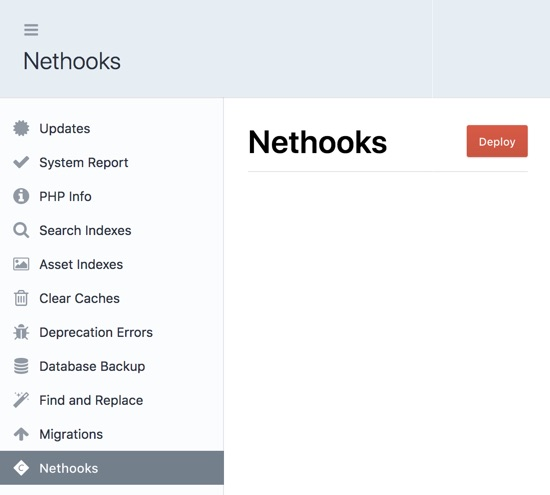

# Nethooks plugin for Craft CMS 3.x

Add Deploy hooks for Netlify

## Requirements

This plugin requires Craft CMS 3.0.0-beta.23 or later.

## Installation

To install the plugin, follow these instructions.

1. Open your terminal and go to your Craft project:

        cd /path/to/project

2. Then tell Composer to load the plugin:

        composer require JungleMinds/nethooks

3. In the Control Panel, go to Settings → Plugins and click the “Install” button for Nethooks.

## NetHooks Overview

This will add a Deploy Button to your Utilities.

## Configuring NetHooks

Go to NetHooks under settings and provide a Netlify Build Webhook [[?]](https://www.netlify.com/docs/webhooks/#incoming-webhooks)

## NetHooks Roadmap

* Expand the set-up to include setting deploy hooks
* Provide an overview of deploys
* deploy status

Brought to you by [Jungle Minds](https://jungleminds.com)
